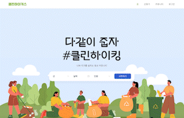

## ⛰ 등산 커뮤니티 "클린 하이커스"



> 해당 프로젝트는 국내 등산로별 쓰레기량을 시각화하여 깨끗한 등산 문화를 독려하고, 등산 모임을 모집하고 참여할 수 있는 커뮤니티 서비스입니다.

### 기여도

- 메인페이지 구현
- 헤더 구현

### 구성

- 메인
  - 원하는 모임 찾기
  - 데이터 시각화
- 회원관리
  - 회원가입, 로그인
  - 회원 정보 조회, 수정
  - 개인 작성 글 목록 조회
- 커뮤니티
  - 게시글 CRUD
  - 댓글 CRUD
- 산찾기
  - 쓰레기량 수치가 높은 산 추천
  - 등산 난이도, 지역별 산 검색
  
### 사용 기술

1. 프론트엔드

- React
- Styled-components
- Ant Design

2. 백엔드

- Express
- Mongodb, Mongoose

### 설치 방법

1. 프론트엔드 서버 실행

```bash
cd front
npm install
npm start
```

2. 백엔드 서버 실행

```bash
cd back
npm install
npm start
```
